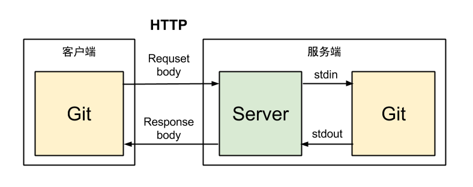


# GitServer

ASP.NET Core 2.0开发Git HTTP Server

设置

```
  "GitSettings": {
    "BasePath": "D:\\Git",
    "GitPath": "git"
  }
```

需要先安装Git,并确保git 命令可以执行

GitPath 可以是 git 的绝对路径

## 功能

### 已完成

- 创建仓库
- 浏览仓库
- git客户端push pull
- 数据库支持 SQLite、MSSQL、MySQL
- 支持用户管理仓库

### 待完成

- 仓库工单（Issue）
- 合并请求（Pull Request）
- 代码评审（Code Review）
- 在线编辑

## 开发

`git clone https://github.com/linezero/GitServer.git`

使用VS 2017 15.3+ 或者VS Code。


## 原理

git client => GitServer => git server



## License

This project is under the [MIT License](LICENSE).
